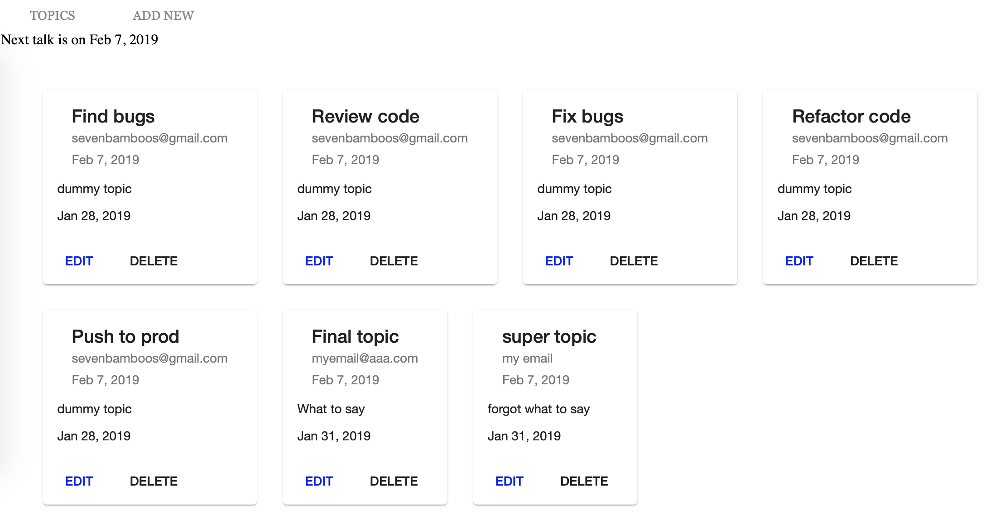
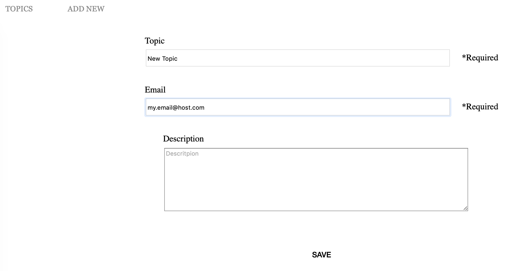

# LightningTalkExercise

## Database server
Start mysql on the default port (3306) with a `test` database. Grant user `developer` (password `12345678`) with all permissions.

In case of `ER_NOT_SUPPORTED_AUTH_MODE`, execute `ALTER USER 'developer'@'localhost' IDENTIFIED WITH mysql_native_password BY 'password'`

Run `cd db && docker build -t <username>/lightning-talk-db-server` to build the Docker image

## Backend API server

Run `npm run api-server-dev` for an API server. Navigate to `http://localhost:3000/`. The app will automatically reload if you change any of the source files under server folder.

Run `docker build -t <username>/lightning-talk-api-server` to build the Docker image.

## Development server

Run `ng serve` for a dev server. Navigate to `http://localhost:4200/`. The app will automatically reload if you change any of the source files.

## Build

Run `ng build` to build the project. The build artifacts will be stored in the `dist/` directory. Use the `--prod` flag for a production build.

## User Interface Overview

Topic List

Topic Editor

## Running unit tests (client side)

Run `ng test` to execute the unit tests via [Karma](https://karma-runner.github.io).

## Running unit tests (server side)

Run `npm run api-server-test` to execute the unit tests via Mocha.

## Running end-to-end tests

Run `ng e2e` to execute the end-to-end tests via [Protractor](http://www.protractortest.org/).

## TODO

* Use Material form fields for topic editor.
* Update exiting topics.
* Select available topics (not all topics) for topic list.
* Support more query options for topic list.
* Show more details for topic.
* More unit test coverage.
